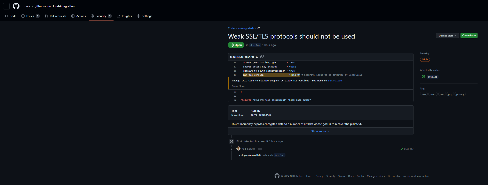

# github-sonarcloud-integration

Scan GitHub repository with SonarCloud

## Setup

### Automatic Analysis

> [!IMPORTANT]
> With Automatic Analysis for .Net, certain rules for .Net source code are automatically deactivated. This includes security rules, all rules that come from outside the Sonar Way quality profile, as well as certain rules from within it.

> [!NOTE]
> Automatic analysis is only supported for GitHub repositories. If you are using a different version control system, you will need to use a different method to analyze your code.

1. Follow the docs under [SonarCloud - Getting Started with GitHub](https://docs.sonarsource.com/sonarcloud/getting-started/github/) to setup `SonarCloud` with `GitHub`
   1. Sign up at [SonarCloud](https://sonarcloud.io/)
   1. Click `Import another organization`
   1. Select your personal GitHub account or the organization that contains the repository you want to scan
   1. When reaching the `Create your SonarCloud organization` page adjust/update data and click `Create organization`
   1. On `Analyze projects` page select the repository you want to scan and click `Set Up`
   1. On `Set up project for Clean as You Code` page select the desired code definition and click `Create project`
1. After completing the setup, the repository will be scanned automatically and you will see the results on the `SonarCloud` dashboard

### CI-based analysis

> [!IMPORTANT]
> Assumption: Automatic analysis is already set up for the repository

To set up CI-based analysis with GitHub actions follow the instructions (guided wizard) under https://sonarcloud.io/project/configuration/GitHubActions?id=SONAR_CLOUD_PROJECT_ID

> [!NOTE]  
> Replace `SONAR_CLOUD_PROJECT_ID` with the id of the SonarCloud project

## Scan Results

### SonarCloud

The scan results can be viewed on the [`SonarCloud` dashboard](https://sonarcloud.io/summary/overall?id=rufer7_github-sonarcloud-integration)

### GitHub

Security hotspots detected by SonarCloud can be viewed directly on the [GitHub repository under `Security` tab in the `Code scanning` section](https://github.com/rufer7/github-sonarcloud-integration/security/code-scanning)

**Example**

### Pull Request (GitHub)

Pull request analysis results can be found directly on the pull requests.

For an example, see [here](https://github.com/rufer7/github-sonarcloud-integration/pull/5)

## Useful Links

- [SonarCloud - Getting Started with GitHub](https://docs.sonarsource.com/sonarcloud/getting-started/github/)
- [Pull request analysis](https://docs.sonarsource.com/sonarcloud/improving/pull-request-analysis/#existing-pull-requests-on-first-automatic-analysis)
